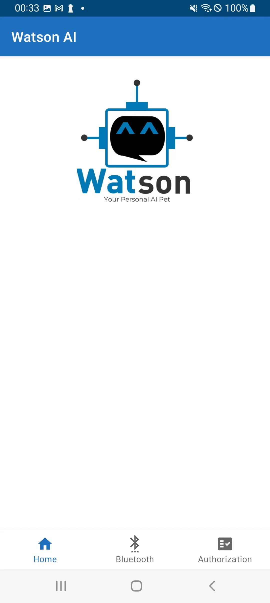
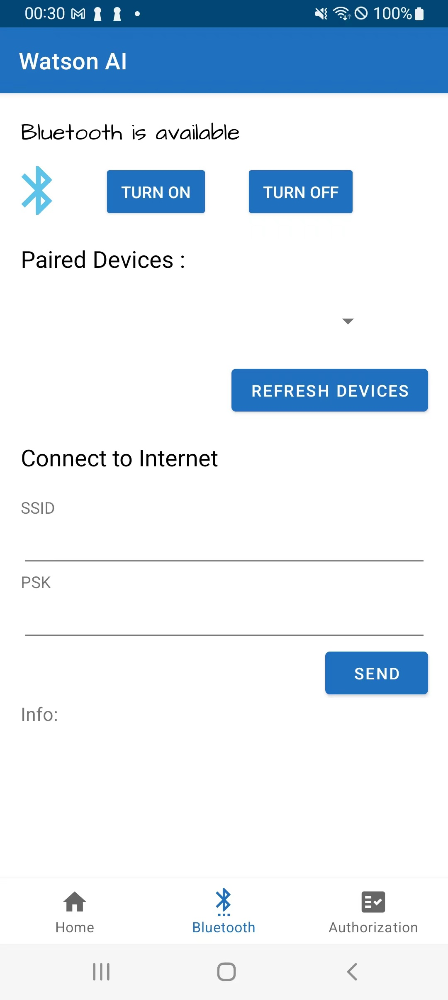
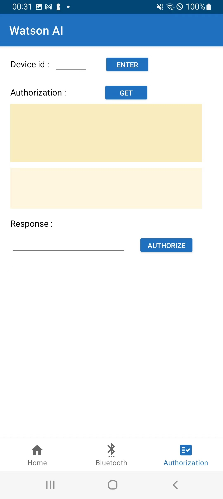

# Android App
## Preview

## Specification
This folder contains all the file need to build the android app for the AI Watson Pet.  
The main files are included in folder [main](android_app/app/src/main/).

### Manifest File
[AndroidManifest.xml](android_app/app/src/main/AndroidManifest.xml) : The manifest file describes essential information about the app to the Android build tools and the Android operating system, which includes the permissions the application requires access to and also declares the android api that the application is going to use.  

### Layout Related File
[main/res](android_app/app/src/main/res/) : This folder contains layout related files, including images used, colors, fonts and etc.
- [layout](android_app/app/src/main/res/layout) : This folder contains all the files required to design the overall layout of the application.
  - [activity_main.xml](android_app/app/src/main/res/layout/activity_main.xml) : This file controls the layout of botton navigation and fragment.
  - [fragment_home.xml](android_app/app/src/main/res/layout/fragment_home.xml), [fragment_bluetooth.xml](android_app/app/src/main/res/layout/fragment_buetooth.xml), and [fragment_authorization.xml](android_app/app/src/main/res/layout/fragment_authorization.xml) : These three files are responsible for designing the layout of each fragment.
  - [bluetooth_devices.xml](android_app/app/src/main/res/layout/bluetooth_devices.xml) and [bluetooth_devices_v1.xml](android_app/app/src/main/res/layout/bluetooth_devices_v1.xml) : These two are helper functions for designing the layout of the spinner.
- [navigation/main_nav.xml](android_app/app/src/main/res/navigation/main_nav.xml) : This is the xml file used to control the three navigation fragments.

### Java Classes
[navigation](android_app/app/src/main/java/com/example/navigation/) : This folder contains all the java classes created to provide various functionalities.
- [MainActivity.java](android_app/app/src/main/java/com/example/navigation/MainActivity.java) : This java class sets up the overall navigation view and also set the title of the actionbar.
- [HomeFragment.java](android_app/app/src/main/java/com/example/navigation/HomeFragment.java) : This java class implements functions in the first fragment. The home fragment shows some general information about the Watson pet and the app. 
- [BluetoothFragment.java](android_app/app/src/main/java/com/example/navigation/BluetoothFragment.java) : This java class implements functions in the second fragment. This fragment is mainly used for turning on the bluetooth of the phone, finding the paired Watson Pet, and sending the local wifi name and password to Watson via bluetooth. This allows the pet to connect to the local wifi and provide services.
- [AuthorizationFragment.java](android_app/app/src/main/java/com/example/navigation/AuthorizationFragment.java): This java class implements functions in the third fragment. It is mainly responsible for doing authorization for Google, Spotify and Twitter. Mqtt is used to transfer message among the mqtt broker, the Watson ai pet and the android app.   
- [BluetoothDeviceAdapter.java](android_app/app/src/main/java/com/example/navigation/BluetoothDeviceAdapter.java): This java class helps to set the content of the spinner as well as the drop down view.

## How to run
### Method 1
If you have Android Studio downloaded, just import the whole [app](android_app/app/) folder into the Android Studio, connect the android phone to computer and run it.

### Method 2
Download the apk and metadata file together under the folder apk_unsigned to your android phone. Remember to changes settings to allow install of unknown apps. 

